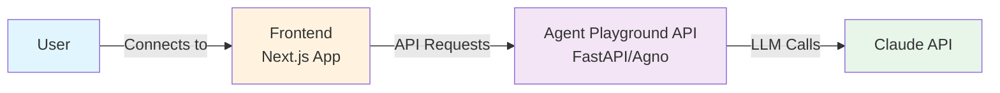

# Deploy and Host Agno on Railway

[](https://railway.com/template/agno-ai-playground?referralCode=rq6lF8)

Agno is a framework for building AI agents with built-in playground UI. This template provides instant deployment of an AI agent playground with zero infrastructure setup.

## About Hosting Agno

Hosting Agno involves deploying a Python FastAPI backend that serves your AI agents alongside a built-in web playground interface. The template handles automatic scaling, HTTPS configuration, and environment management, requiring only an API key to get started with production-ready AI agents.

## Common Use Cases

- Building conversational AI assistants and chatbots
- Creating specialized agents for customer support or internal tools
- Prototyping and testing AI agent behaviors with interactive playground
- Deploying multi-agent systems with different capabilities
- Integrating AI agents with external APIs and databases

## Dependencies for Agno Hosting

- Python 3.13+ runtime environment
- Anthropic API key for Claude models
- Agno framework (included in template)
- FastAPI for API endpoints

### Deployment Dependencies

- [Agno Documentation](https://docs.agno.com)
- [Anthropic Console](https://console.anthropic.com) for API keys
- [Claude Model Documentation](https://docs.anthropic.com/claude/models)

### Implementation Details

```python
# Minimal Agno agent setup
from agno import Agent
from agno.models.anthropic import Claude

agent = Agent(
    name="Assistant",
    model=Claude(id="claude-sonnet-4-20250514"),
    instructions=["You are a helpful AI assistant"],
    markdown=True,
)

# Agno automatically provides playground UI at PORT
agent.playground(port=int(os.getenv("PORT", 8080)))
```

## Why Deploy Agno on Railway?

Railway is a singular platform to deploy your infrastructure stack. Railway will host your infrastructure so you don't have to deal with configuration, while allowing you to vertically and horizontally scale it.

By deploying Agno on Railway, you are one step closer to supporting a complete full-stack application with minimal burden. Host your servers, databases, AI agents, and more on Railway.

---

### 🚀 One-Click Deploy

Click the button above to deploy your own AI agent playground in seconds. The template includes:

- Pre-configured Agno agent with Claude 4 Sonnet
- Built-in playground UI for testing and interaction
- Automatic HTTPS and scaling on Railway
- Zero DevOps knowledge required

### 🔑 Setup Requirements

After deploying, you'll need to add your Anthropic API key:

1. Go to your Railway project settings
2. Add environment variable: `ANTHROPIC_API_KEY=your-api-key-here`
3. Get your API key from [Anthropic Console](https://console.anthropic.com)

### 💡 What You Get

- **AI Agent**: A minimal Claude-powered assistant ready to customize
- **Playground UI**: Interactive web interface for testing your agent
- **Production Ready**: Automatic scaling, HTTPS, and monitoring
- **Extensible**: Easy to add tools, knowledge bases, and more

### 🏗️ Architecture



The Agno playground consists of:
- **Frontend**: TypeScript/Next.js app from [agno-agi/agent-ui](https://github.com/agno-agi/agent-ui)
- **Backend**: Python FastAPI service with Agno framework (main.py)
- **Integration**: Frontend communicates with backend via REST API

## 🛠️ Customization

The template provides a minimal starting point. You can extend it with:

- **Tools**: Add web search, database queries, API calls
- **Knowledge Bases**: Connect vector databases, documents
- **Multiple Agents**: Create specialized agents for different tasks
- **Storage**: Add conversation history with SQLite/PostgreSQL

### Example: Adding Tools

```python
from agno.tools.duckduckgo import DuckDuckGoTools

agent = Agent(
    name="Research Assistant",
    model=Claude(id="claude-sonnet-4-20250514"),
    tools=[DuckDuckGoTools()],
    instructions=["Always cite your sources"],
    markdown=True,
)
```

## 💻 Local Development

```bash
# Clone your deployed project
git clone your-railway-repo-url
cd railway-agno-ai-playground

# Setup environment
uv venv --python 3.13
source .venv/bin/activate

# Install dependencies
uv sync

# Set API key
export ANTHROPIC_API_KEY=your-key-here

# Run locally
python main.py
```

## 🌐 Environment Variables

| Variable | Description | Required |
|----------|-------------|----------|
| `ANTHROPIC_API_KEY` | Your Anthropic API key | Yes |
| `PORT` | Server port (auto-provided by Railway) | No |
| `CORS_ORIGINS` | Allowed CORS origins (default: `*` allows all). Use comma-separated list for multiple origins | No |

## 📚 Resources

- [Agno Documentation](https://docs.agno.com)
- [Railway Documentation](https://docs.railway.com)
- [Anthropic API](https://console.anthropic.com)

## 🏗️ Built For Zero-Config Deployment

This template is designed for developers who want to:
- Build AI applications without infrastructure complexity
- Deploy production-ready agents in minutes
- Focus on agent logic, not DevOps

---
Made with 💎 by [Shiny Pebble](https://shiny-pebble.com/) • [MIT License](LICENSE)